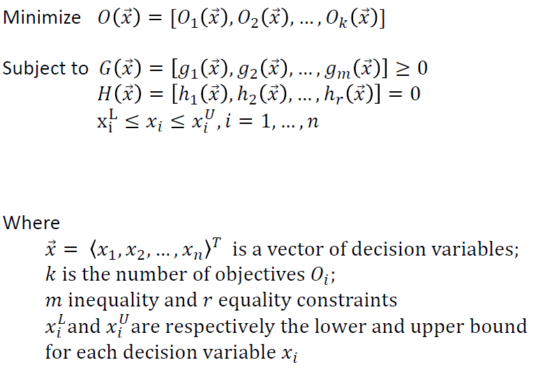

# Introduction

---

## Search-Based Software Engineering (SBSE)

The term SBSE was first used in 2001 by Harman and Jones [1]

---

## Trend in SBSE

---

#### Multi Objective Optimization (MOO)

---

#### Many-Objective Publications

---

### Trend
| Sr. No. | Year | No. of Multi/Many Objective Optimization Problems Related Papers Published | Number of Papers |
| ------- | ---- | ------------------------------------------------------------ | ---------------- |
| 1       | 2005 | 1                                                            | 1                |
| 2       | 2006 | 1                                                            | 1                |
| 3       | 2007 | 1                                                            | 1                |
| 4       | 2008 | 2                                                            | 7                |
| 5       | 2009 | 7                                                            | 7                |
| 6       | 2010 | 7                                                            | 7                |
| 7       | 2011 | 10                                                           | 10               |
| 8       | 2012 | 12                                                           | 12               |
| 9       | 2013 | 18                                                           | 20               |
| 10      | 2014 | 21                                                           | 22               |
| 11      | 2015 | 19                                                           | 20               |
| 12      | 2016 | 27                                                           | 28               |
| 13      | 2017 | 25                                                           | 26               |
*Table 1: Number of Papers Published in Major Conferences and Journals in Recent Years (Mane and Rao [4])*

---

Definition:

1. **SBSE** [1]
	
	- SBSE converts a software engineering problem into a computational search problem that can be tackled with a metaheuristic.
	- Some Examples are Tabu Search and Evolution Algorithms
	
2. **Metaheuristic** [2]
	- higher-level procedure or heuristic  designed to find, generate, or select a heuristic (partial search algorithm) that may provide a sufficiently good solution to an optimization problem, especially with incomplete or imperfect information or limited computation capacity
	
3. **Many-Objective Problems (MaOPs)** [4]
	- More challenging than MOP:
	  - Consist of more than three Objectives
	- <u>High computational cost</u> due to increased evaluation of number of points required for Pareto front approximation 
	- Inability of existing evolutionary multi-objective algorithms to solve many-objective optimization problems 
	- <u>Difficulty to visualize</u> the Pareto front with more than four objectives.

