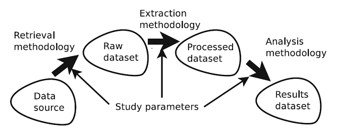

# Reproducibility

## Aim of any reproducibility [9]:

1.  **<u>Evidence of correctness</u>**
2.  **<u>New observations</u>**
3.  **<u>Increasing data complexity usage</u>**
4.  **<u>The focus remains on the content of the data analysis</u>** 
5.  **<u>Increasing Reproducibility [7]</u>**
    - less effort
    - new reproduction means

## Problems (González-Barahona and Roble [7]) (de Oliveira Neto et al. [5]):

- Methodology focus
- Software and data access
- Software Testing
- scope definition

::: notes

- Reproducibility researchers usually focus on the description of the methodology [7]
	- They hope to reproduce them with the same, similar, or completely different source data to verify, complement or extend the results
- Methodology in a paper may not be enough [7]
- Lack of access to such software and data [7]
  - This discourages and makes reproduction more difficult
- Evaluating is not easy since many information and artefacts are required in order to thoroughly evaluate the capabilities of a testing technique [5]
- Software testing is very multidisciplinary [5]
- Drawing a precise line to establish the scope affecting the test is very challenging [5]

:::

## One Solution: Compendiums [5]

- RCC  [Reproducibility Research Compendium](https://research-compendium.science/)
- tagged with "research compendium"  [8]

::: notes

- RCC ( Reproducibility Research Compendium) [8]
	- Usually provided by the researcher
	- it is a container that provides all necessary components to reproduce the research
- https://research-compendium.science/ 
	- a collection of tools and sites where researchers can upload their RCC. 
	- the website shows a collection of RCC tagged research
	- yet there is not one agreed upon standard on the container and framework 
	- they tried to simplify the process by making researchers add a tag to there repository "research compendium" or "research-compendium"
	

:::

## Elements that Impact Reproducibility

::: notes

1. **<u>Data source</u>**: Where the “real world” data resides .
2. **<u>Retrieval methodology</u>**. Data has to be retrieved if the researchers can't work directly with the Source
3. **<u>Raw dataset.</u>** Data “as such”, directly obtained from the data source by means of the retrieval methodology. 
4. **<u>Extraction methodology.</u>** Process, usually implemented (totally or in part) with software tools, of extracting, cleaning and storing the relevant data from the raw dataset.
5. **<u>Study parameters.</u>**  parameters control which study part actually is being analyzed. 
6. **<u>Processed dataset.</u>** The application of the extraction methodology (and possibly the study parameters) to the raw dataset produces the processed dataset, which will be the input to the analysis methodology. 
7. **<u>Analysis methodology.</u>** Process, usually implemented (totally or in part) with software tools, of how the processed dataset is analyzed and studied to obtain the results dataset.
8. **<u>Results dataset.</u>** It is produced by applying the analysis methodology to the processed dataset and will be the basis for the research results and outcomes. 

:::

## Impact Level on Reproducibility [7]

- *Identification*
- *Description*
- *Availability*
- *Persistence*
- *Flexibility*

::: notes

The level of detail, availability, and characteristic  of each elements impacts heavily on the reproducibility.
difficulty level is determined by:

- *Identification*: Where can the (original) element be obtained from?
- *Description*: How detailed is the published information about the element, including its internal organization and structure, and its semantics?
- *Availability*: How easy is it for a researcher to obtain the element, or have access to it?
- *Persistence*: How likely is the element to be available in the future?
- *Flexibility*. How flexible is the element, how easily can it be adapted to new environments?

:::

